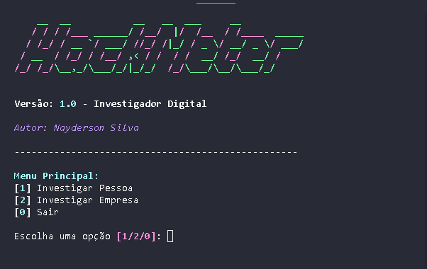

# HackMeter 🔍 - Nayderson

**Versão 1.0**

---




## 📌 Objetivo

O **HackMeter** é uma ferramenta de investigação digital que simula um ambiente de análise cibernética, permitindo ao usuário pesquisar dados públicos de **pessoas ou empresas** e gerar relatórios completos com visual profissional.

Desenvolvido com o foco em praticidade, interface estilo "terminal hacker" e coleta real de dados abertos, o HackMeter foi pensado para uso por:

- Técnicos de informática
- Profissionais de segurança
- Curiosos e entusiastas de OSINT (Open Source Intelligence)

---

## 🛠 Tecnologias Utilizadas

- **Python 3.11+**
- `rich` para visual bonito no terminal
- `pyfiglet` para arte ASCII
- `duckduckgo_search` para buscas públicas
- `requests` para consultas de CNPJ
- Módulos próprios organizados em `modules/`

---

## ⚙️ Como funciona

### 1. Menu interativo
O sistema inicia com uma interface no terminal com opções:

```
[1] Investigar Pessoa
[2] Investigar Empresa
[0] Sair
```

### 2. Coleta de dados
O usuário insere nome, e-mail, telefone e redes sociais para **pessoas**, ou nome, CNPJ e site para **empresas**.

### 3. Análise em tempo real
A ferramenta busca:

- Informações no DuckDuckGo (públicas)
- Dados do CNPJ via API gratuita da ReceitaWS
- Links relacionados à identidade pesquisada

### 4. Geração de relatório
Após a análise, é possível gerar um `.txt` com:

- Dados fornecidos
- Informações encontradas
- Links úteis
- Formatação clara, ideal para documentação ou arquivamento

---

## 📂 Exemplo de Relatório

```
====================================
        RELATÓRIO HACKMETER
====================================

🕵️ Tipo de investigação: PESSOA
📅 Data: 01/06/2025 14:00

Nome: João da Silva
Email: joaodasilva@email.com
Telefone: (00) 0000-0000
Instagram: @joaodasilva
Facebook: João da Silva

🔎 Resultados encontrados:
- Gmail - Google Accounts → https://accounts.google.com/...
- João | Instagram → https://instagram.com/joaodasilva
- João Silva - Facebook → https://facebook.com/story/...
```

---

## 📸 Prints do projeto

> *(adicione aqui prints do terminal rodando, como o menu, uma busca completa e o relatório gerado)*

---

## 🤯 Dificuldades enfrentadas

- 🧱 *Rate limit da API do DuckDuckGo*: resolvido com tratamento de erro e `sleep`.
- 💥 *Falha ao importar funções*: resolvido organizando os módulos e nomes corretamente.
- 🧩 *Salvar dados reais no relatório*: implementado retorno de dados nos módulos `recon_email`, `recon_social` e `recon_empresa`.

---

## 🚀 Próximos passos

- [ ] Exportação do relatório em PDF
- [ ] Interface web estilo terminal (Flask + JS)
- [ ] Avaliação automática de risco (ex: perfil suspeito)
- [ ] Histórico de investigações anteriores

---

## 🧠 Desenvolvido por

**Desenvolvedor - Nayderson**  
[GitHub](https://github.com/Nerdzter)

---

> 💡 Sinta-se à vontade para clonar, testar, contribuir ou apenas se inspirar nesse projeto. Qualquer feedback é bem-vindo!
